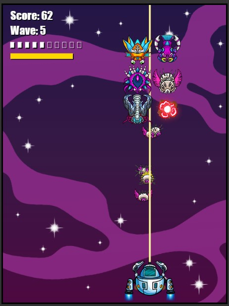
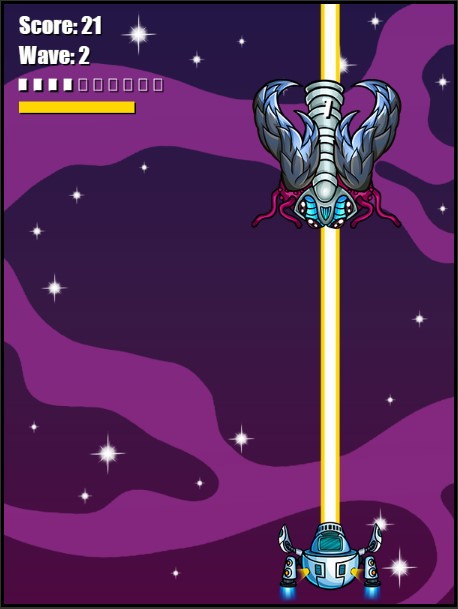
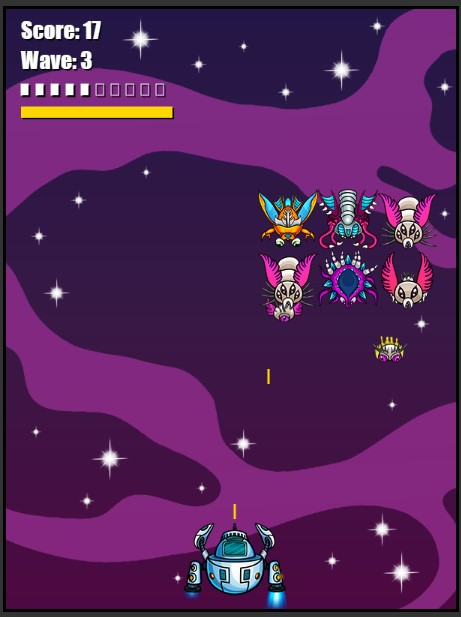

### Space Invaders: Invasores del Espacio
<div style="display: flex; justify-content: space-around; flex-wrap: wrap; gap: 8px">



</div>

Este es un juego clásico inspirado en Space Invaders, desarrollado con JavaScript, HTML y CSS. Enfréntate a hordas de bichos extraterrestres y jefes desafiantes en una batalla por la supervivencia de la Tierra.

#### Cómo Jugar
1. **Objetivo**: Defiende la Tierra disparando a los invasores alienígenas antes de que alcancen el suelo.
   
2. **Controles**:
   - Utiliza las teclas de flecha izquierda (`←`) y derecha (`→`) para mover la nave espacial.
   - Presiona los botones `1`, `2` y `3` para disparar diferentes tipos de disparos:
     - `1`: Disparo normal de bala.
     - `2`: Disparo con láser débil.
     - `3`: Disparo con láser fuerte.

3. **Niveles**:
   - El juego consta de varios niveles con diferentes configuraciones de invasores y jefes.
   - Cada nivel aumenta en dificultad, con oleadas que aumentan en cantidad de invasores y jefes que requieren más disparos para ser derrotados.

4. **Puntuación**:
   - Ganas puntos por cada invasor eliminado.
   - Derrotar a un jefe otorga puntos adicionales.
   - Con cada nivel superado aumenta tu vida.

#### Características del Juego
- **Animaciones y Gráficos**: Animaciones fluidas y gráficos retro que capturan la esencia del juego original.

- **Desafíos Estratégicos**: Planifica tus movimientos para esquivar ataques y optimizar tus disparos para maximizar la puntuación.

#### Instalación y Ejecución
1. Clona este repositorio en tu máquina local:
```
git clone https://github.com/FernandoRodriguezValdivia/space-invaders.git
```

2. Abre el archivo `index.html` en tu navegador web preferido.

3. ¡Disfruta del juego y salva a la Tierra de la invasión extraterrestre!

---

¡Prepárate para la batalla y demuestra tus habilidades en Space Invaders: Invasores del Espacio!
